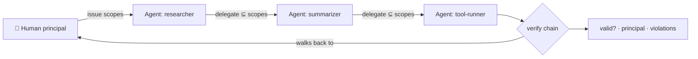

<a name="top"></a>
<div align="center">


# agentpassport

### Cryptographically prove *which human* authorized *which AI agent* to do *what* — even 4 hops deep.

[](LICENSE)   [](https://github.com/cognis-digital/cognis-neural-suite)

`#ai-agents` `#identity` `#authorization` `#agentic-ai` `#mcp` `#security` `#oauth`

</div>

**The unsolved 2026 problem:** ~80% of orgs running autonomous agents *can't trace an agent's actions back
to a human*, and 45% still authenticate agents with shared API keys. OAuth/MCP handle one hop — but the
**delegation chain loses its anchor** at hop 3-4. `agentpassport` fixes exactly that: signed, scope-narrowing
delegation chains you can verify back to a human principal.

```bash
pip install "git+https://github.com/cognis-digital/agentpassport.git"
agentpassport issue researcher --principal chris --scopes read,search,write --key K > p.json
agentpassport delegate p.json summarizer --scopes read,search --key K2 > p2.json   # subset only
agentpassport verify p2.json --keys '{"human:chris":"K","agent:researcher":"K2"}' --require write
# → valid:false, violation: required scope 'write' not held at final hop  ✅ escalation blocked
```

<!-- cognis:layman:start -->
## What is this?

When an AI agent hands off a task to another AI agent, it is easy to lose track of who originally gave permission for what. `agentpassport` solves this by creating a digital "chain of custody" — a short, signed document that travels with the task and records every handoff, all the way back to the human who started it. Each step can only grant the same permissions or fewer, so no agent can quietly gain more access than it was given. You can verify the whole chain at any point and instantly know if something is wrong.
<!-- cognis:layman:end -->

## Architecture



## Why it's different
Every hop is HMAC-signed and **can only narrow** scopes — escalation is detected. Verification walks the
whole chain back to the human anchor, so you get the one thing OAuth/MCP can't give you today:
**accountable, multi-hop agent authorization.**

## Use it from any AI stack
MCP server (`agentpassport mcp`), JSON in/out for any agent runtime, drop-in for
[uncensored-fleet](https://github.com/cognis-digital/uncensored-fleet) / LangChain / CrewAI delegation.

## Prior art / standards
Aligned with **IETF draft-klrc-aiagent-auth** (AIMS), **NIST** agent-identity concept paper, **MCP**, and
**Mastercard Agent Pay** tokenization. Production: anchor the HMAC demo in real PKI / SPIFFE.

<a name="verification"></a>
<!-- cognis:install:start -->
## Install

`agentpassport` is source-available (not published to PyPI) — every method below installs
straight from GitHub. Pick whichever you prefer; the one-line scripts auto-detect
the best tool available on your machine.

**One-liner (Linux / macOS):**
```sh
curl -fsSL https://raw.githubusercontent.com/cognis-digital/agentpassport/HEAD/install.sh | sh
```

**One-liner (Windows PowerShell):**
```powershell
irm https://raw.githubusercontent.com/cognis-digital/agentpassport/HEAD/install.ps1 | iex
```

**Or install manually — any one of:**
```sh
pipx install "git+https://github.com/cognis-digital/agentpassport.git"     # isolated (recommended)
uv tool install "git+https://github.com/cognis-digital/agentpassport.git"  # uv
pip install "git+https://github.com/cognis-digital/agentpassport.git"      # pip
```

**From source:**
```sh
git clone https://github.com/cognis-digital/agentpassport.git
cd agentpassport && pip install .
```

Then run:
```sh
agentpassport --help
```
<!-- cognis:install:end -->

## Verification

[](AUDIT.md)

Every push is verified end-to-end. Latest audit (2026-06-13):

```text
tests        : 1 passed, 0 failed, 0 errored
compile      : all modules parse
cli          : agentpassport 0.1.0
package      : agentpassport
```

<details><summary>CLI surface (<code>--help</code>)</summary>

```text
usage: agentpassport [-h] [--version] {issue,delegate,verify} ...

Verifiable agent identity + multi-hop delegation.

positional arguments:
  {issue,delegate,verify}

options:
  -h, --help            show this help message and exit
  --version             show program's version number and exit
```
</details>

Full machine-readable results: [`AUDIT.md`](AUDIT.md) · regenerate with `python -m agentpassport --help` + `pytest -q`.

<div align="right"><a href="#top">↑ back to top</a></div>


## Related
[🤖 uncensored-fleet](https://github.com/cognis-digital/uncensored-fleet) · [🛡️ guardpost](https://github.com/cognis-digital/guardpost) · [🧰 toolguard](https://github.com/cognis-digital/toolguard) · [🗂️ the suite](https://github.com/cognis-digital/cognis-neural-suite)

> ### ⭐ Star it — agent identity is the problem nobody's solved yet.

## License
COCL v1.0 — see [LICENSE](LICENSE).
