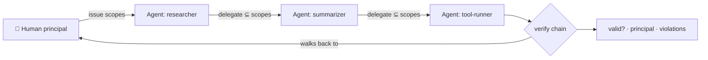

<a name="top"></a>
<div align="center">


# agentpassport

### Cryptographically prove *which human* authorized *which AI agent* to do *what* — even 4 hops deep.

[](LICENSE)   [](https://github.com/cognis-digital/cognis-neural-suite)

`#ai-agents` `#identity` `#authorization` `#agentic-ai` `#mcp` `#security` `#oauth`

</div>

**The unsolved 2026 problem:** ~80% of orgs running autonomous agents *can't trace an agent's actions back
to a human*, and 45% still authenticate agents with shared API keys. OAuth/MCP handle one hop — but the
**delegation chain loses its anchor** at hop 3-4. `agentpassport` fixes exactly that: signed, scope-narrowing
delegation chains you can verify back to a human principal.

```bash
pip install cognis-agentpassport
agentpassport issue researcher --principal chris --scopes read,search,write --key K > p.json
agentpassport delegate p.json summarizer --scopes read,search --key K2 > p2.json   # subset only
agentpassport verify p2.json --keys '{"human:chris":"K","agent:researcher":"K2"}' --require write
# → valid:false, violation: required scope 'write' not held at final hop  ✅ escalation blocked
```

## Usage — step by step

1. **Install** the tool:
   ```bash
   pip install cognis-agentpassport
   ```
2. **Issue a passport** for an agent, anchoring it to a human principal with an explicit scope set. `--key` signs it:
   ```bash
   agentpassport issue researcher --principal chris --scopes read,search,write --key K > p.json
   ```
3. **Delegate** to a child agent — scopes can only narrow (subset), never escalate:
   ```bash
   agentpassport delegate p.json summarizer --scopes read,search --key K2 > p2.json
   ```
4. **Verify** the chain back to the human. `--keys` is a JSON map of issuer-to-key; `--require` asserts a scope must be held at the final hop:
   ```bash
   agentpassport verify p2.json --keys '{"human:chris":"K","agent:researcher":"K2"}' --require write
   # -> valid:false, violation: required scope 'write' not held at final hop  (escalation blocked)
   echo $?   # non-zero when verification fails
   ```
5. **Automate in CI / a gateway** — verify the presented passport before honoring an agent action:
   ```yaml
   - run: pip install cognis-agentpassport
   - run: agentpassport verify "$AGENT_PASSPORT" --keys "$TRUSTED_KEYS" --require write
   ```

## Architecture



## Why it's different
Every hop is HMAC-signed and **can only narrow** scopes — escalation is detected. Verification walks the
whole chain back to the human anchor, so you get the one thing OAuth/MCP can't give you today:
**accountable, multi-hop agent authorization.**

## Use it from any AI stack
MCP server (`agentpassport mcp`), JSON in/out for any agent runtime, drop-in for
[uncensored-fleet](https://github.com/cognis-digital/uncensored-fleet) / LangChain / CrewAI delegation.

## Prior art / standards
Aligned with **IETF draft-klrc-aiagent-auth** (AIMS), **NIST** agent-identity concept paper, **MCP**, and
**Mastercard Agent Pay** tokenization. Production: anchor the HMAC demo in real PKI / SPIFFE.

## Related
[🤖 uncensored-fleet](https://github.com/cognis-digital/uncensored-fleet) · [🛡️ guardpost](https://github.com/cognis-digital/guardpost) · [🧰 toolguard](https://github.com/cognis-digital/toolguard) · [🗂️ the suite](https://github.com/cognis-digital/cognis-neural-suite)

> ### ⭐ Star it — agent identity is the problem nobody's solved yet.

## Interoperability

`agentpassport` composes with the 300+ tool Cognis suite — JSON in/out and a shared
OpenAI-compatible `/v1` backbone. See **[INTEROP.md](INTEROP.md)** for the
suite map, composition patterns, and reference stacks.

## Integrations

Forward `agentpassport`'s findings to STIX/MISP/Sigma/Splunk/Elastic/Slack/webhooks via
[`cognis-connect`](https://github.com/cognis-digital/cognis-connect). See **[INTEGRATIONS.md](INTEGRATIONS.md)**.

## License
COCL v1.0 — see [LICENSE](LICENSE).
